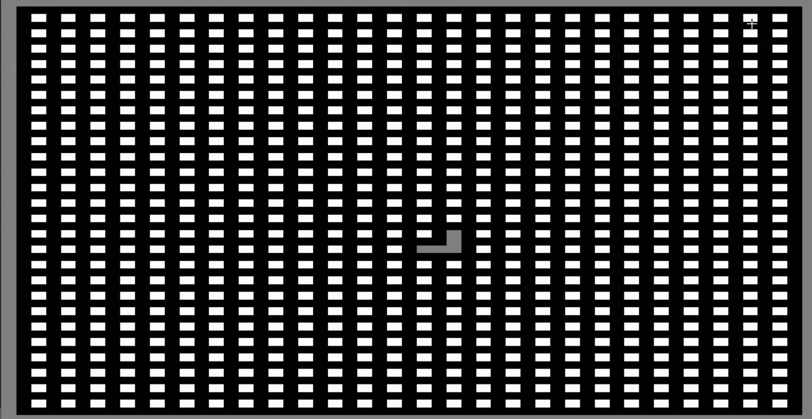

# mazegen

mazegen is a python package that creates randomly generated mazes. Curently, it supports the following algorithms:

* Recursive Backtracking Algorithm
* Aldous-Broder Algorithm
* Hunt and Kill Algorithm
* Prims Algorithm

## How to Install

In the future, the project will be available on PyPI so you could use pip. For now, you have to clone the project and add the files to your directory. You will need all the python files in order to use all the algorithms provided.

## How to Use

The code is OS independent, so it should work on all platforms. To generate mazes, you could do the following:

```python
from mazegen import generate_maze

generate_maze("backtracking", 101, 101, "Maze.png", True)
```

The first argument is the **algorithm** used to generate the maze. It is in form of a string and currently could be the following:

* "backtracking"
* "aldous_broder"
* "hunt_and_kill"
* "prims"

Each string corresponds with its algorithm.

The second and third arguments are the **height** and **width** respectively. Note that because of how the algorithms work, the height and width must be odd numbers. If even numbers are given, the generator adds 1 to them to make them odd.

The forth argument is the **path** were the image is saved. The path is relative to the location of <span>mazegen.py</span>.

The Fith and last argument is a boolean which determines if to show the maze in a window after generation. If True, an OpenCV window will open containing the generatred maze.

## Examples

Below you can see gifs of how the mazes are generated and images of the final maze for each algorithm.

**Note:** Images are upscaled.

### Recursive Backtracking

#### Code

```python
from mazegen import generate_maze

generate_maze("backtracking", 55, 55, "Maze.png", True)
```

#### Process


#### Final Maze


### Adous-Broder

#### Code

```python
from mazegen import generate_maze

generate_maze("aldous_broder", 55, 55, "Maze.png", True)
```

#### Process



#### Final Maze


### Hunt and Kill

#### Code

```python
from mazegen import generate_maze

generate_maze("hunt_and_kill", 55, 55, "Maze.png", True)
```

#### Process


#### Final Maze


### Prims

#### Code

```python
from mazegen import generate_maze

generate_maze("prims", 55, 55, "Maze.png", True)
```

#### Process


#### Final Maze


## Misc

### Student Hobby Project

Please note that this is simply a student hobby project. There might be, and certainly are, areas of improvements. All feedbacks are much appreciated.

### Futre

Here are my plans for the future of this projects:

* Adding more algorithms
* Optimizing current algorithms further more
* Creating a package of this project and adding it to PyPI
